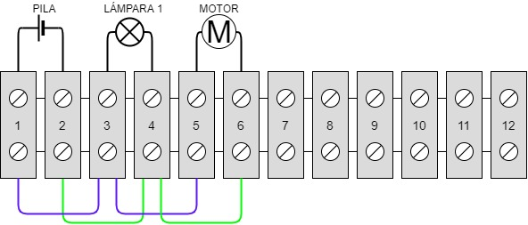

# Circuitos con clemas

En una clema el montaje es sencillo, aunque requiere de un cierto aprendizaje que conviene realizar con circuitos sencillos, hasta que el alumnado coja soltura.  

Dejo por aquí algún ejemplo:  

## Circuito serie en clema

 

### Montaje en clema:
 

## Circuito paralelo en clema

 

### Montaje en clema:

