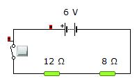
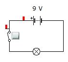
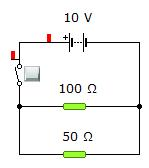
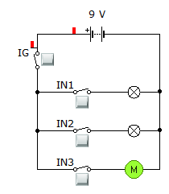
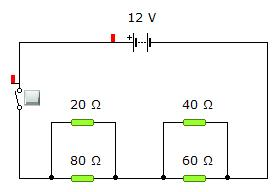
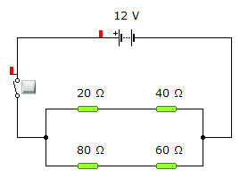
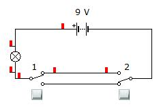

# PRÁCTICAS DE ELECTRICIDAD 3º E.S.O.

Proponemos a nuestro alumnado de 3º de E.S.O. la realización de unas sencillas prácticas con Crocodile Technology, para familiarizarse con el manejo de programas sencillos de simulación de situaciones físicas.

Puedes descargar Crocodile Technology desde [este enlace](https://github.com/angelmicelti/TecnoVilladiego3/raw/master/4EstruMeca/Electricidad/Cocodrile%20Technology%206.07%5BPortable%5D.zip).

Puedes ver/descargar las hojas de respuestas en estos enlaces:

- [Hoja 1 (anverso)](h1a.pdf)
- [Hoja 1 (reverso)](h1r.pdf)
- [Hoja 2 (anverso)](h2a.pdf)
- [Hoja 2 (reverso)](h2r.pdf)

HAZ **CLIC EN CADA IMAGEN** PARA ACCEDER A LA **FICHA DE LA PRÁCTICA**.

## Práctica 1: circuito elemental. Elementos de maniobra

## Práctica 2: circuito serie (I)

## Práctica 3: circuito serie (II)

## Práctica 4: circuito paralelo

## Práctica 5: control de componentes en un circuito paralelo

## Práctica 6: circuito mixto paralelo-serie

## Práctica 7: circuito mixto serie-paralelo

## Práctica 8: luz conmutada desde dos puntos

### Haz clic en cada imagen para ver la guía de dicha práctica
