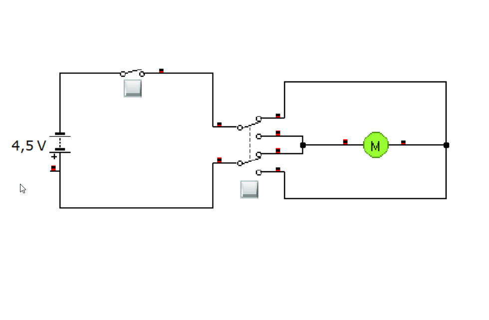

# Circuitos en clemas
Mira cómo se pueden montar **circuitos en clemas**. Pulsa [este enlace](circuclemas.md).

# Circuitos de interés

## Llaves de cruce

### Llave de cruce sin finales de carrera

### Llave de cruce con finales de carrera
  

---

# [Prácticas de electricidad](practicas.md)

## Descarga [Crocodile Technology V6.07 Portable](https://raw.githubusercontent.com/angelmicelti/TecnoVilladiego3/master/4EstruMeca/Electricidad/Cocodrile%20Technology%206.07%5BPortable%5D.zip)  

## Descarga [Crocodile Clips 3.5 Portable](https://github.com/angelmicelti/TecnoVilladiego3/raw/master/4EstruMeca/Electricidad/Crocodile-Clips.zip)
