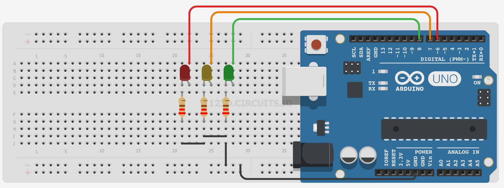
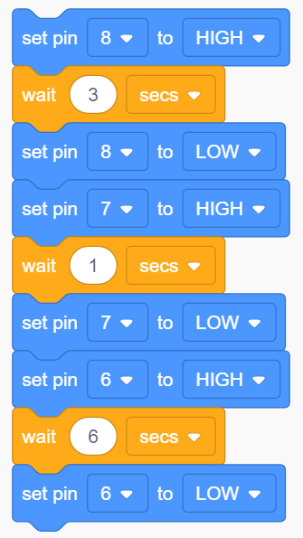
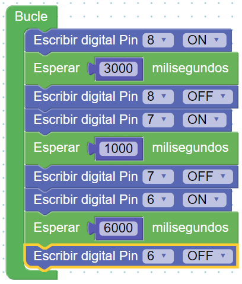

# Proyecto 4: Semáforo para vehículos

Llega el momento de darle un poco de color a los ledes que utilizamos en nuestros montajes.
Parece, entonces, lógico realizar un proyecto como un semáforo.
En él ya tendremos que incluir tres luces (antes hemos hecho un proyecto con ocho, tranquil@s). Lo importante es que ahora tendrán que estar **sincronizadas**. Bueno, no es que antes no lo estuvieran, pero ahora quedarán con más estilo.

En nuestro semáforo, vamos a fijar los siguientes tiempos para cada una de las luces:
- Luz roja: 6 segundos
- Luz ámbar: 1 segundo
- Luz verde: 3 segundos

La duración de un ciclo completo será, pues, de 10 segundos.

## [Montaje en Tinkercad](https://www.tinkercad.com/things/f83grFjS9rd-4-semaforo-para-trafico-rodado-bloques)

## Código en TinkerCAD

## Código en ArduinoBlocks

Puedes ver más información y el código completo en [este enlace](http://www.arduinoblocks.com/web/project/10362)

## Mira cómo funciona

