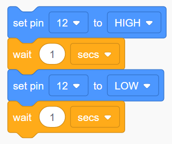

# LED intermitente

Llamamos a este sencillo montaje BLINK u "Hola Mundo", porque es el primer programa que realizamos en Arduino.

## [Montaje en Tinkercad](https://www.tinkercad.com/things/58pb1LnwuDn-1-blink-bloques)

## Código en TinkerCAD

## Código en ArduinoBlocks

Puedes ver el código completo en el [siguiente enlace](http://www.arduinoblocks.com/web/project/10323).

## Mira cómo funciona

