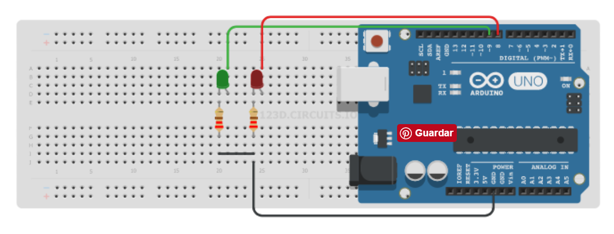

# Semáforo para vehículos y peatones

Añadimos ahora dos luces para que pueda regularse, además del tráfico de vehículos, el paso de los peatones.
Si te fijas bien, esto último no es sino lo que hicimos en el montaje número 2, correspondiente a los ledes alternativos. Eso sí, ahora hay que sincronizar con las tres luces del semáforo del ejemplo anterior.

## [Montaje en Tinkercad](https://www.tinkercad.com/things/cmflkUUKtsg-2-leds-alternativos)

## Vídeo

## [Visualiza el código Arduino](ledes_alternativos/ledes_alternativos.ino)

