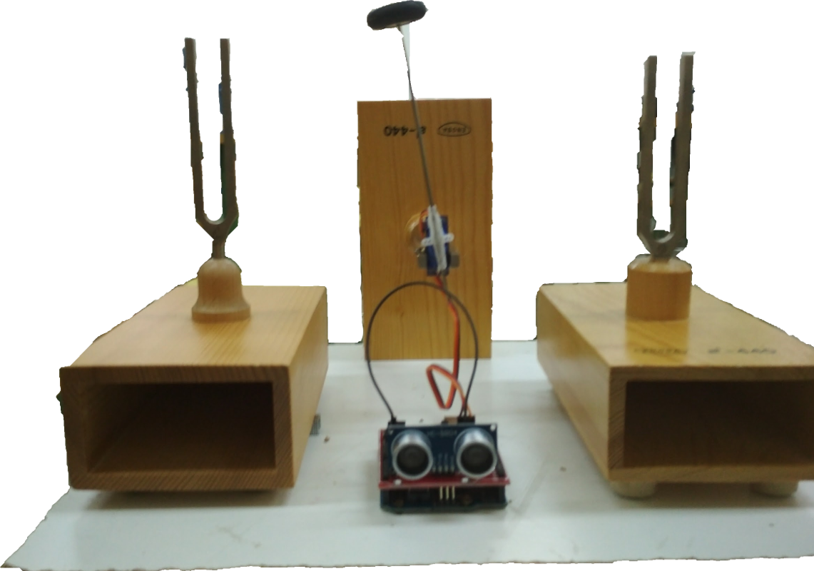
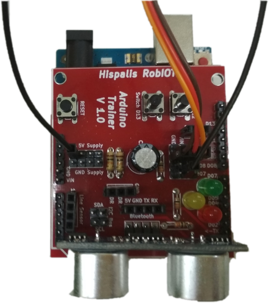

# **CucoClock**

_**MATERIALES NECESARIOS**_
- Dos diapasones
- Dos ledes
- Un sensor de ultrasonidos
- Una fotorrsistencia
- Un interruptor
- Una placa Arduino UNO
- Cables para conexión

_**CARACTERÍSTICAS DEL PROYECTO**_
Se pretende construir un reloj a la antigua usanza: un pequeño mazo golpeará alternativamente dos diapasones, situados a los extremos de su recorrido. La frecuencia será de 1 Hz.

Entre cada golpe permanecerá un LED encendido.

La puesta en marcha se producirá de los siguientes modos:
1. Siempre funcionando
2. Funcionammiento al accionar un pulsador
3. Funcionamiento cuando se detecta la presencia de un usuario a cierta distancia.
4. Funcionamiento cuando se den condiciones de oscuridad.

Resultado:

