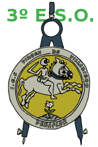

# TecnoVilladiego3
Repositorio de Tecnología del alumnado de 3º de E.S.O. del I.E.S. Virgen de Villadiego, de Peñaflor (Sevilla)

## PROGRAMACIÓN

  * ### [Arduinoblocks](ArduinoBlocks/readme.md)
  * ### [Scratch](http://scratch.mit.edu)
***

## ELECTRICIDAD
  * ### [Prácticas de electricidad con Crocodile Technology](Electricidad/practicas.md)
***

## [MECÁNICA](Mecánica/readme.md)
***

## [DISEÑO 3D CON SKETCHUP](Sketchup/readme.md)
***

## [DISEÑO CON QCAD](QCAD/qcad.md)
***

## [PROYECTOS](/Proyectos/readme.md)
***
