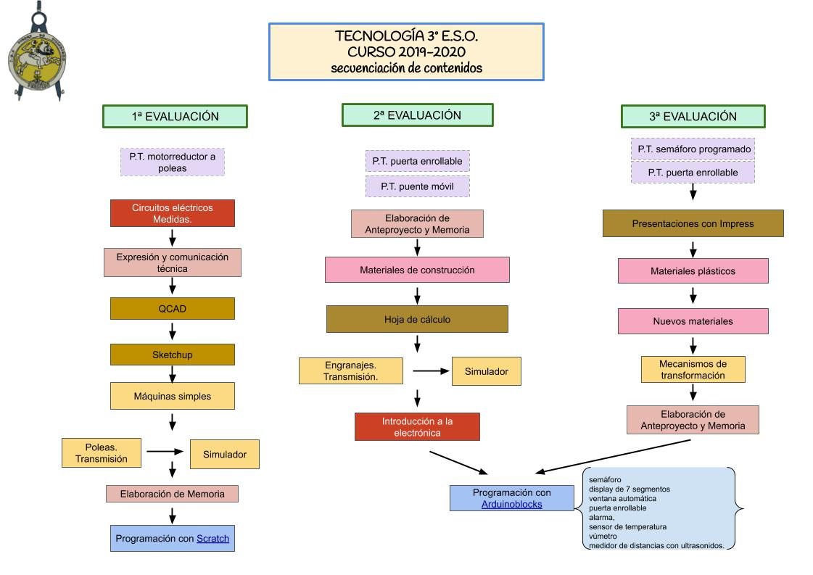

<h1 align="center">TecnoVilladiego3</h1>

<h3 align="center"> Repositorio para el alumnado de Tecnología o Ámbito Práctico de 3º de E.S.O.

del IES Virgen de Villadiego,
de Peñaflor, Sevilla

</h3>

## [Bloque 1: Proceso de resolución de problemas tecnológicos](1Proceso/readme.md)

## [Bloque 2: Expresión y comunicación técnica](2Expresion/readme.md)

## [Bloque 3: Materiales de uso técnico](3Materiales/readme.md)

## [Bloque 4: Estructuras y mecanismos: máquinas y sistemas](4EstruMeca/readme.md)

<h3 align="center">

[MECÁNICA](4EstruMeca/Mecanica/readme.md)

[ELECTRICIDAD](4EstruMeca/Electricidad/readme.md)

[Prácticas de electricidad con Crocodile Technology](4EstruMeca/Electricidad/practicas.md)

</h3>

## [Bloque 5: Iniciación a la programación y sistemas de control](5ProgSisCont/readme.md)

<h3 align="center">

[Programación con Scratch](5ProgSisCont/Scratch/readme.md)

[Programa Arduino con Arduinoblocks](5ProgSisCont/ArduinoBlocks/readme.md)

</h3>

## [Bloque 6: Tecnologías de la Información y la Comunicación](6TIC/readme.md)

<h3 align="center">

[Publicando información en Internet](6TIC/readme.md)

</h3>

***
<h2 align="center">

[PROYECTOS](Proyectos/readme.md)

</h2>

***

